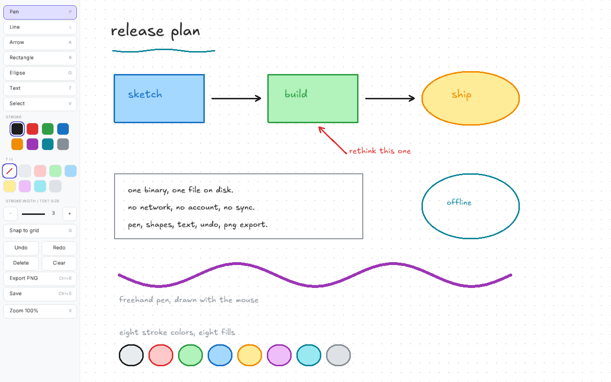
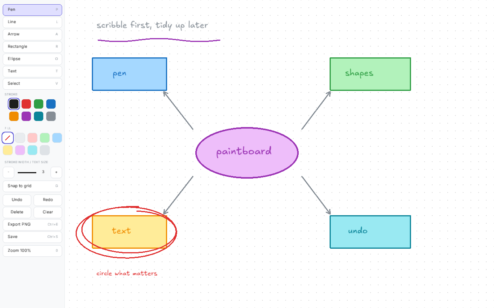

# Paintboard

A small local drawing board written in C. Draw freehand, place shapes, add text, and
move things around. Drawing works offline and boards stay in a single file on
disk. Optional collaboration sends canvas snapshots to a selected agent for visual replies.

Excalidraw is the reference. This is the small offline version of it.



## Features

- Freehand pen, line, arrow, rectangle, ellipse, and text.
- Select one item, shift click to add more, or drag a box around a group.
- Move a selection, or drag a corner handle to resize it.
- Copy, cut, paste, and duplicate.
- Undo and redo, up to 256 steps.
- Eight stroke colors and eight fill colors.
- Dot grid with optional snapping.
- Infinite canvas with pan and zoom.
- Save to a small binary file. Export the visible canvas to PNG.
- Two fonts are built into the binary, so the program has no font setup.
- The panel scales with the monitor DPI and scrolls on short windows.
- MCP server for agents to inspect and edit a live canvas, or work headlessly.
- Optional collaboration: pause while drawing and Codex, Claude Code, OpenCode,
  or a custom agent replies on the canvas.



## Install

### Nix flake

```sh
nix run github:0xPD33/paintboard          # run it once
nix profile install github:0xPD33/paintboard
```

### NixOS or home-manager

Add the flake as an input:

```nix
inputs.paintboard.url = "github:0xPD33/paintboard";
inputs.paintboard.inputs.nixpkgs.follows = "nixpkgs";
```

Then install the package. The flake also exports `overlays.default`, which adds
`pkgs.paintboard`.

```nix
home.packages = [ inputs.paintboard.packages.${pkgs.system}.default ];
# or, on NixOS:
environment.systemPackages = [ inputs.paintboard.packages.${pkgs.system}.default ];
```

### From source

You need GLFW 3.4 or newer, an OpenGL library, cJSON, Python 3, pkg-config, and a compiler with
C23 `#embed`. GCC 15 or Clang 19 are new enough.

```sh
make
sudo make install            # installs to /usr/local
make install PREFIX=~/.local # or install for one user
```

`make install` also writes the desktop entry and the icons, so Paintboard shows
up in your application launcher.

`nix develop` gives you a shell with the build tools and with `resvg`, which
`make icon` uses to redraw `assets/paintboard.png` after you edit the logo.
Run `make test` to exercise the board operations and MCP server; the protocol
tests use Python 3's standard library, included in the development shell.

## Use

```sh
paintboard              # opens board.pb in the current directory
paintboard notes.pb     # opens or creates notes.pb
paintboard --help
```

The window opens at 85% of the monitor work area and saves the board when you
close it.

### Tools

| Key | Tool |
| --- | --- |
| `P` | Pen |
| `L` | Line |
| `A` | Arrow |
| `R` | Rectangle |
| `O` | Ellipse |
| `T` | Text |
| `V` | Select |

### Select and edit

| Key or action | Result |
| --- | --- |
| Click | Select one item |
| Shift click | Add an item to the selection, or remove it |
| Drag empty space | Select every item inside the box |
| Drag a selected item | Move the whole selection |
| Drag a corner handle | Resize the whole selection |
| `Ctrl+A` | Select all |
| `Esc` | Clear the selection |
| `Del` | Delete the selection |
| `Ctrl+Z` | Undo |
| `Ctrl+Y` or `Ctrl+Shift+Z` | Redo |
| `Ctrl+D` | Duplicate |
| `Ctrl+C`, `Ctrl+X`, `Ctrl+V` | Copy, cut, paste at the pointer |

### Style

| Key or action | Result |
| --- | --- |
| `1` to `8` | Set the stroke color |
| `[` and `]` | Change the stroke width and the text size |
| `G` | Turn grid snapping on or off |
| Panel swatches | Set the stroke color and the fill color |

A style key changes the current tool setting. If something is selected, it also
changes the selection.

### Text

Pick the text tool and click the canvas to start typing. Press `Enter` for a new
line and `Esc` when you finish. Click an existing text item with the text tool to
edit it again. Text grows and shrinks with `[` and `]`.
These keys resize the text while typing. `Ctrl+S` saves and `Ctrl+E` exports
without leaving text editing. Erasing all the text removes the item when you
finish; undo restores it. Starting an empty item and finishing cancels it.

The caret always sits at the end. Backspace removes the last character, and there
are no arrow keys inside a text item yet.

### View and files

| Key or action | Result |
| --- | --- |
| Right or middle drag | Pan |
| Wheel | Zoom at the pointer, or scroll the panel when over it |
| `Ctrl+=` / `Ctrl+-` | Zoom in / out |
| `0` | Reset pan and zoom |
| `Ctrl+S` | Save |
| `Ctrl+E` | Export a PNG next to the board file |

The PNG export writes what the canvas shows right now, without the grid and
without the tool panel. Pan and zoom to frame the picture before you export it.

The panel scales with the monitor DPI and scrolls when the window is short. Set
`PAINTBOARD_UI_SCALE=1.5` to scale the panel and the selection handles by hand.

## Agents and MCP

Open Paintboard normally, then click **Collaborate: Off** to turn collaboration
on. The toggle controls both prompted agent access and automatic replies.

```sh
paintboard notes.pb
```

- Draw, pause for about 1.5 seconds, and the selected agent will inspect the canvas and add a
  short response in purple text, arrows, or shapes. The panel shows when it is
  thinking. Finish text editing with Esc before expecting a response.
- Ask your connected agent in chat to look at the drawing or add something.
  Its tools attach to this same window.
- Turn Collaborate off to stop the watcher and block agent reads and edits.
  Responses based on an older drawing or a previous toggle session are discarded.
- Each response is one undo step. Agent edits and Undo/Redo do not trigger
  another automatic reply; the watcher waits for your next drawing edit.

The **AUTO REPLY** control cycles through installed **Codex**, **Claude Code**,
**OpenCode**, and **Chat only** (prompted MCP access without automatic replies).
Paintboard checks PATH and common user install directories on startup. Click
**R** beside the selector to refresh after installing an agent. Switching agents
cancels any pending reply. Codex is the initial choice when available; selection
lasts for the current window. Discovery checks executables, not sign-in readiness.

Automatic replies use the selected CLI's existing sign-in and model configuration
in separate sessions, without your chat's conversation history. Only the current
canvas image and board data are supplied. Use `PAINTBOARD_CODEX_MODEL`,
`PAINTBOARD_CLAUDE_MODEL`, or `PAINTBOARD_OPENCODE_MODEL` to override the model
(OpenCode uses `provider/model`). `PAINTBOARD_MODEL` remains a Codex-only alias.
`PAINTBOARD_CODEX`, `PAINTBOARD_CLAUDE`, and `PAINTBOARD_OPENCODE` override executable
locations. `paintboard-bridge --discover` prints detected paths. Drawing remains
available if an agent is unavailable; failures appear in the panel and stderr.

### Custom agents

Click **+** beside AUTO REPLY, enter a launch command, choose a connection mode,
then **Save & use**. The command is checked for an installed executable and becomes
the **Custom** choice. Settings survive restarts; clearing the command removes it.
The setup currently stores one custom command, which you can replace at any time.
Saving a command cancels any pending reply. It runs when collaboration is on.

- **ACP** connects to agents implementing [Agent Client Protocol v1](https://agentclientprotocol.com/protocol/v1/initialization)
  over stdin/stdout. For example, `opencode acp --pure` uses the generic connection.
  The agent must advertise image support and already be signed in. Paintboard
  creates a session, sends the canvas and board data, and converts its final JSON
  response into annotations. Incomplete replies are discarded. Client file and
  terminal services are unavailable, and permission requests are declined.
- **Command: prompt on stdin** runs a CLI once per reply. The prompt includes
  board data and the annotation schema. Pass the image through an argument such
  as `my-agent --image {image} --prompt-file {prompt_file}`. This is a template;
  use the flags supported by your agent. It must return annotation JSON on stdout
  or write it to `{output}`. JSON code fences are accepted.
- **Command: JSON request on stdin** is for wrapper programs. It receives a JSON
  object with `version: 1`, `prompt`, `board`, `image` (`mimeType` and base64 `data`),
  `paths`, and `output_schema`. Its output uses the same annotation format.

Command arguments support `{image}`, `{prompt}` (the actual prompt text),
`{prompt_file}`, `{board}`, `{schema}`, `{request}`, and `{output}`. All other
placeholders name temporary files. `{request}` and the `PAINTBOARD_REQUEST`
environment variable point to the complete JSON request. These files last only
for the reply. Quote arguments containing spaces; expansion happens after argument
splitting, without an implicit shell. Prefer `{prompt_file}` over `{prompt}` for
large boards to avoid operating-system argument size limits.

For example, a wrapper can return:

```json
{"annotations":[{"type":"text","x0":300,"y0":200,"x1":0,"y1":0,"text":"Check this connection"}]}
```

At most six annotations may be returned, using `text`, `arrow`, `rect`, or `ellipse`
in world coordinates. A supplied output file takes precedence over stdout;
otherwise keep diagnostics on stderr. Custom programs use their own authentication
and tool settings; choose their non-interactive mode and appropriate permissions.
Paintboard cannot infer an arbitrary CLI's image flags or output format from its
executable name. Agents without ACP or suitable CLI output need a wrapper, or can
connect through MCP for prompted use.

The saved configuration is `$XDG_CONFIG_HOME/paintboard/custom-agent.json`, falling
back to `~/.config/paintboard/custom-agent.json`. It stores `command` and `transport`
(`acp`, `command`, or `json`), with owner-only file permissions. Sign in using the
agent's own CLI rather than putting credentials in the command.

Connect Codex to the live attachment bridge:

```sh
codex mcp add paintboard -- paintboard-bridge --mcp
```

For a source checkout, use `python3 /absolute/path/to/paintboard-bridge` as the
server command. The bridge can start before a canvas is open and does not own the
window: disconnecting a chat leaves the drawing open. It connects over a private
local Unix socket, with no listening TCP port. If several windows are open, add
`--board /absolute/path/to/notes.pb` to select one explicitly.

The bridge also supports direct calls, which work without restarting a chat:

```sh
python3 ./paintboard-bridge --list
python3 ./paintboard-bridge --call get_board
python3 ./paintboard-bridge --call get_canvas --image-out /tmp/canvas.png
```

The binary still supports client-owned stdio sessions and headless automation:

```sh
paintboard --mcp /absolute/path/to/notes.pb
paintboard --mcp --headless /absolute/path/to/notes.pb
```

These explicitly opt in to agent access and own their board session. Use one
process per board file to avoid competing saves. Headless mode cannot capture or
export the live canvas. The stdio server writes only protocol messages to stdout.

For clients that use an `mcpServers` JSON configuration:

```json
{
  "mcpServers": {
    "paintboard": {
      "command": "/absolute/path/to/paintboard-bridge",
      "args": ["--mcp"]
    }
  }
}
```

The server exposes these tools:

| Tool | Purpose |
| --- | --- |
| `get_status` | Discover the window, toggle state, human revision, and whether editing is in progress |
| `get_canvas` | Read a canvas image without writing an export file |
| `get_board` | Read items, bounds, viewport, and the current revision; supports pagination |
| `add_items` | Add a batch of shapes, pen strokes, or text |
| `update_items` | Replace complete items at specified indices |
| `delete_items` | Delete specified indices |
| `undo`, `redo` | Use the shared human/agent history |
| `set_view` | Set pan and zoom to frame the drawing |
| `save_board` | Save to the file chosen at startup |
| `export_png` | Save the visible canvas and return an image preview |

Start with `get_board` and `get_canvas`. When adding a response to a snapshot,
pass its `revision` and `collaboration_epoch` to `add_items` so late responses are
rejected. `update_items`, `delete_items`, `undo`, and `redo` require
the latest `revision`, returned by reads and edits. A stale revision is rejected;
read the board again before retrying. Indices follow paint order and can shift
after deletion or undo. Edits are rejected while a human is dragging or typing.
Each successful batch is one undo step, and an invalid batch changes nothing.

For example, the arguments to `add_items` can be:

```json
{
  "items": [
    {"type": "rect", "x0": 220, "y0": 80, "x1": 480, "y1": 180, "fill": 3},
    {"type": "text", "x0": 245, "y0": 110, "text": "Agent-created note"}
  ]
}
```

Coordinates are world units. At the default view, the tool panel covers the left
168 logical pixels times the UI scale; `get_board` reports the window size.
Pen items use absolute `[x, y]` pairs in `points`. Text uses
`x0`, `y0`, and `text`; the other shapes use two corners/endpoints. Stroke width
defaults to 3 and text size is seven times the width. Color indices `0`–`7`
follow the panel palette, and fill `-1` means transparent. Full schemas are
available through `tools/list`.

Call `save_board` to persist edits explicitly. Closing the window saves; closing
the client-owned `paintboard --mcp` stdin also saves. Disconnecting the attachment
bridge does not close or save the window. The MCP implementation follows the
[stdio transport](https://modelcontextprotocol.io/specification/2025-11-25/basic/transports)
and [tool protocol](https://modelcontextprotocol.io/specification/2025-11-25/server/tools).

The protocol tests can also exercise a live display with
`PAINTBOARD_TEST_LIVE=1 python3 tests/test_mcp.py ./paintboard`.
`tests/test_collaboration.py` verifies scheduling, cancellation, discovery, and
the three built-in CLI adapters without making model calls.
`tests/test_custom_agents.py` verifies command expansion, ACP capabilities,
streaming, permission denial, timeouts, and stale-response cancellation.
`tests/test_collaboration_live.py` uses X11 and XTest on a private test display
to exercise the selector, custom setup, saved configuration, and replies. The real Codex
smoke test is opt-in with `PAINTBOARD_TEST_REAL_CODEX=1`.

## Files

A board is one binary file. The format is described in
[ARCHITECTURE.md](ARCHITECTURE.md). Paintboard also reads the older `PB02` files
and writes them back in the current format.

## Design notes

Read [ARCHITECTURE.md](ARCHITECTURE.md) for the data model, the render loop, the
undo system, and the file format.

## Third party

The `vendor/` directory holds the stb single file libraries and the two fonts,
Inter and Excalifont. See [vendor/NOTICE](vendor/NOTICE) for the credits and the
licenses.

## License

MIT. See [LICENSE](LICENSE).
