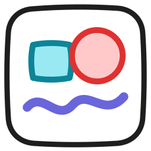

# Paintboard

A local drawing board in one C file. Draw freehand, place shapes, add text, and
move things around. Paintboard never touches the network and keeps your boards
in a single file on disk.

Excalidraw is the reference. This is the small offline version of it.

## Features

- Freehand pen, line, arrow, rectangle, ellipse, and text.
- Select one item, shift click to add more, or drag a box around a group.
- Move a selection, or drag a corner handle to resize it.
- Copy, cut, paste, and duplicate.
- Undo and redo, up to 256 steps.
- Eight stroke colors and eight fill colors.
- Dot grid with optional snapping.
- Infinite canvas with pan and zoom.
- Save to a small binary file. Export the visible canvas to PNG.
- Two fonts are built into the binary, so the program has no font setup.

## Install

### Nix flake

```sh
nix run github:0xPD33/paintboard          # run it once
nix profile install github:0xPD33/paintboard
```

### NixOS or home-manager

Add the flake as an input:

```nix
inputs.paintboard.url = "github:0xPD33/paintboard";
inputs.paintboard.inputs.nixpkgs.follows = "nixpkgs";
```

Then install the package. The flake also exports `overlays.default`, which adds
`pkgs.paintboard`.

```nix
home.packages = [ inputs.paintboard.packages.${pkgs.system}.default ];
# or, on NixOS:
environment.systemPackages = [ inputs.paintboard.packages.${pkgs.system}.default ];
```

### From source

You need GLFW 3.4 or newer, an OpenGL library, pkg-config, and a compiler with
C23 `#embed`. GCC 15 or Clang 19 are new enough.

```sh
make
sudo make install            # installs to /usr/local
make install PREFIX=~/.local # or install for one user
```

`make install` also writes the desktop entry and the icons, so Paintboard shows
up in your application launcher.

`nix develop` gives you a shell with the build tools and with `resvg`, which
`make icon` uses to redraw `assets/paintboard.png` after you edit the logo.

## Use

```sh
paintboard              # opens board.pb in the current directory
paintboard notes.pb     # opens or creates notes.pb
paintboard --help
```

The window saves the board when you close it.

### Tools

| Key | Tool |
| --- | --- |
| `P` | Pen |
| `L` | Line |
| `A` | Arrow |
| `R` | Rectangle |
| `O` | Ellipse |
| `T` | Text |
| `V` | Select |

### Select and edit

| Key or action | Result |
| --- | --- |
| Click | Select one item |
| Shift click | Add an item to the selection, or remove it |
| Drag empty space | Select every item inside the box |
| Drag a selected item | Move the whole selection |
| Drag a corner handle | Resize the whole selection |
| `Ctrl+A` | Select all |
| `Esc` | Clear the selection |
| `Del` | Delete the selection |
| `Ctrl+Z` | Undo |
| `Ctrl+Y` or `Ctrl+Shift+Z` | Redo |
| `Ctrl+D` | Duplicate |
| `Ctrl+C`, `Ctrl+X`, `Ctrl+V` | Copy, cut, paste at the pointer |

### Style

| Key or action | Result |
| --- | --- |
| `1` to `8` | Set the stroke color |
| `[` and `]` | Change the stroke width and the text size |
| `G` | Turn grid snapping on or off |
| Panel swatches | Set the stroke color and the fill color |

A style key changes the current tool setting. If something is selected, it also
changes the selection.

### Text

Pick the text tool and click the canvas to start typing. Press `Enter` for a new
line and `Esc` when you finish. Click an existing text item with the text tool to
edit it again. Text grows and shrinks with `[` and `]`.

The caret always sits at the end. Backspace removes the last character, and there
are no arrow keys inside a text item yet.

### View and files

| Key or action | Result |
| --- | --- |
| Right or middle drag | Pan |
| Wheel | Zoom at the pointer |
| `0` | Reset pan and zoom |
| `Ctrl+S` | Save |
| `Ctrl+E` | Export a PNG next to the board file |

The PNG export writes what the canvas shows right now, without the grid and
without the tool panel. Pan and zoom to frame the picture before you export it.

## Files

A board is one binary file. The format is described in
[ARCHITECTURE.md](ARCHITECTURE.md). Paintboard also reads the older `PB02` files
and writes them back in the current format.

## Design notes

Read [ARCHITECTURE.md](ARCHITECTURE.md) for the data model, the render loop, the
undo system, and the file format.

## Third party

The `vendor/` directory holds the stb single file libraries and the two fonts,
Inter and Excalifont. See [vendor/NOTICE](vendor/NOTICE) for the credits and the
licenses.

## License

MIT. See [LICENSE](LICENSE).
